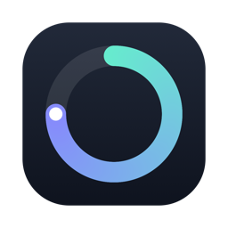

<p align="center"></p>

# Tempo

A tiny native macOS menu bar app that shows how far you are through your work
day, week, month, and year — in a glassy, customizable drop-down panel with
**Now / Tasks / Week** tabs.

Default work schedule: **Mon–Fri, 10:00 → 18:00**. The day hits 0% at 10:00 and
100% at 18:00; the week runs Monday 10:00 → Friday 18:00 (work hours only).
Month and year can each count either work hours or plain calendar time.

## Install

You need macOS 14+ and Swift. If you don't have Swift, run
`xcode-select --install` once (the free Command Line Tools are enough — no
Xcode needed).

```sh
git clone https://github.com/aditya14as/tempo.git
cd tempo
./build.sh
cp -R dist/Tempo.app /Applications/
open /Applications/Tempo.app
```

Look for the `T 87% · W 37%`-style item in your menu bar and click it. Turn on
**Launch at login** in the panel's settings (gear icon) so it starts with your
Mac.

The build is unsigned (ad-hoc), so if macOS complains on first launch,
right-click the app → Open. To try it without installing, skip the `cp` line
and just `open dist/Tempo.app`.

## Customize (gear icon in the panel)

- Work start/end times and which days count as workdays — plus **per-day
  hours** (e.g. Friday 10:00–17:00), which day/week/month/year math all honor
- **Split a day into slots** (up to 4): e.g. 11:00–12:00 and 14:00–15:00 —
  breaks between slots don't count toward progress
- **Top 5 tasks** right in the panel: check off your focus items for the day
  - Give a task a **due date & time** (clock button): one-tap presets
    (In 2h / Tonight / Tomorrow / Next Mon), a real calendar, and a time
    stepper — Tempo sends a notification when it's due, and the chip turns
    red when overdue
  - **Week tab**: this week + next week at a glance, with each task dotted
    on its due day and an agenda list underneath
  - **Add to Apple Reminders** from the clock popover (asks for Reminders
    access the first time)
- **Shelf** (tray icon in the panel footer): a small always-on-top window.
  Drop files or links into it from Finder, VS Code, or a browser, then drag
  them out into Mail, Slack, anywhere — like a notch shelf. It floats, so
  it stays open while you go grab things.
- Show/hide each row (Today / Week / Month / Year) and pick its style:
  **percent, bar, ring, or dot grid**
- **Counting basis per period**, with inheritance:
  - Week: work hours (from the daily schedule) or calendar
  - Month: *like week*, work hours, or calendar
  - Year: *like month*, *like week*, work hours, or calendar
  - "Like X" follows whatever that period is set to; a caption in settings
    shows what each period resolves to right now
- Menu bar item: live percentage text, plain icon, or a tiny filling ring —
  and which metric it tracks
- Accent theme: Aurora, Sunset, Ocean, Mono

Everything saves automatically and survives restarts.

## Development

```sh
swift build                     # debug build
.build/debug/Tempo --check      # run the progress-math self-checks
swift run Tempo                 # run the app directly (no bundle)
```

Self-checks live in `Sources/Tempo/Checks.swift` (Command Line Tools ship no
XCTest, so tests are a `--check` flag on the binary). To quit the app, click
the menu bar item and press the power button in the panel footer.
